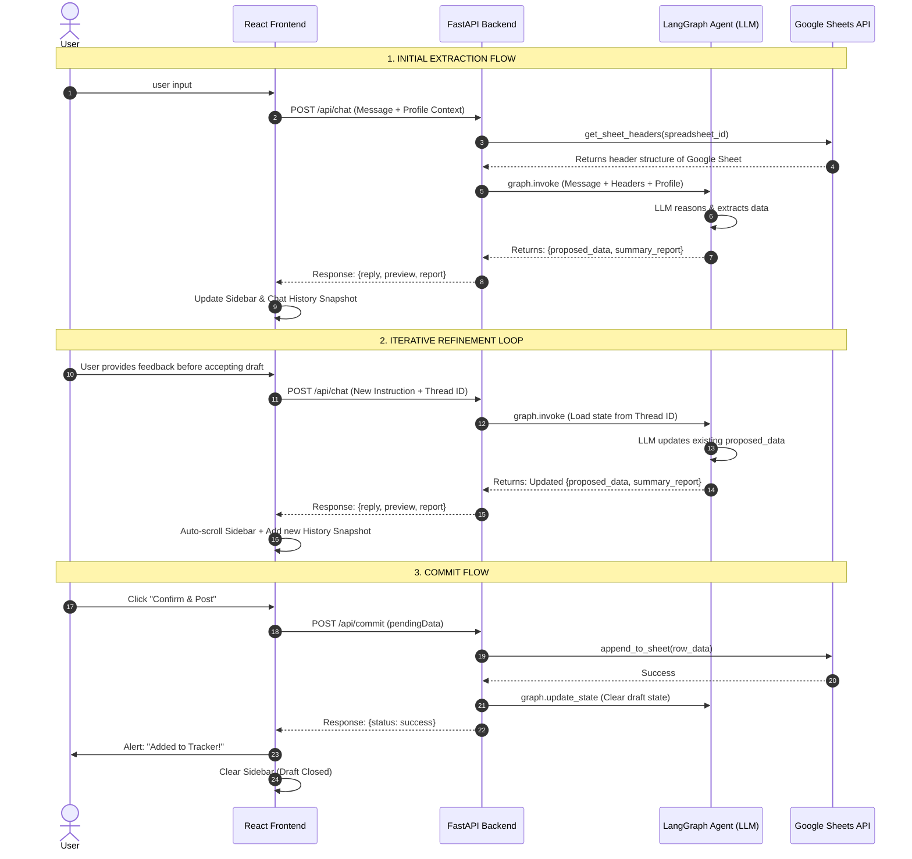

# LeetCode Tracker AI

**Team Member:** Caleb Hageman  
**Chosen Domain:** Agentic Data Orchestration (Software Engineering Technical Interview Prep)

## Overview
LeetCode Tracker AI is a chat-integrated workspace designed to seamlessly extract, format, and log problem-solving sessions into a Google Spreadsheet. Using an agentic workflow, users can describe coding problems or activities in natural language, and the system's LLM automatically maps the narrative to the dynamic schema of their connected Google Sheet. System prompts are fully dynamic and can be customized via the user profile, enabling schema-agnostic data orchestration that applies to any domain-specific formatting.

## Architecture and Data Flow
The application implements a full Agentic Workflow with Tool Calling, satisfying the **Conceptual System Architecture** requirements:

1. **User Interface:** A React (Vite) frontend provides a chat interface, a profile settings panel for prompt customization, and a live data preview sidebar.
2. **Prompt Engineering:** The backend constructs prompts combining user profile data (experience, goals, preferences) and specific formatting instructions derived from the spreadsheet schema.
3. **Advanced Technique (LangGraph Agent & Tool Calling):** The backend utilizes **LangGraph** to maintain a stateful conversation thread. It employs **Tool Calling** to interact with the Google Sheets API (fetching live headers and appending rows).
4. **LLM Integration:** The agent reasons through the user's input using the LLM (Gemini 2.5 Flash), extracting relevant fields (e.g., Problem Name, Difficulty, Approach) that match the sheet's columns.
5. **Iterative Refinement:** The extracted data is returned as a "Draft" to the frontend. The user can submit follow-up refinements in the chat. The agent updates the draft in its state, and the UI maintains an expandable history of these iterations within the chat thread before the user finally commits the data to Google Sheets.



### Description of Stages
1. **Discovery:** The system dynamically fetches headers from Google Sheets so the AI knows the exact schema.
2. **Extraction:** The LangGraph agent uses the Gemini LLM to map natural language to the sheet schema.
3. **Refinement:** The `thread_id` allows the LLM to remember the current draft across multiple chat messages.
4. **Persistence:** Data is only sent to Google Sheets once the user is satisfied with the preview.

## Folder Structure
- `frontend/`: React (TypeScript/Vite) application containing the UI, chat interface, and data preview components.
- `backend/`: Python (FastAPI) server hosting the LangGraph agent, tool definitions, and Google OAuth flow.
- `package.json`: Root-level script runner for convenient project setup.

## Setup Instructions

### Prerequisites
- Node.js (v18+)
- Python (3.10+)
- A Google Cloud Project with the Google Sheets API enabled and OAuth 2.0 Client IDs configured.
- Docker (optional but recommended)

### 1. Environment Variables
1. Copy the `example.env` file to a new file named `.env` in the root directory.
   ```bash
   cp example.env .env
   ```
2. Fill in the required values in `.env`:
   - `GOOGLE_API_KEY`: Your Gemini/Google AI API key.
   - `SPREADSHEET_ID`: The ID from your Google Sheet URL.
   - `GOOGLE_APPLICATION_CREDENTIALS`: Path to your Google Service Account JSON.
   - `GOOGLE_CLIENT_ID` & `GOOGLE_CLIENT_SECRET`: OAuth 2.0 credentials for Google Sign-in.
   - `GOOGLE_OAUTH_REDIRECT_URI`: Usually `http://localhost:8000/api/auth/google/callback`.
   - `SESSION_SECRET`: A random string for cookie security.
   - `FRONTEND_URL`: Usually `http://localhost:5173`.
   - `VITE_API_URL`: Usually `http://localhost:8000`.

### 2. Installation & Running (Docker - Recommended)
The easiest way to start the project is using Docker Compose if docker is already installed:

```bash
docker-compose up --build
```
This will launch the frontend, backend, and all necessary networking automatically.

### 3. Installation & Running (Manual)
If you prefer to run without Docker, you can install dependencies for both the frontend and backend from the root directory:

```bash
npm run install:all
```

Then start both servers:

```bash
npm start
```

- The **Frontend** will be available at `http://localhost:5173`
- The **Backend API** will be available at `http://localhost:8000`
