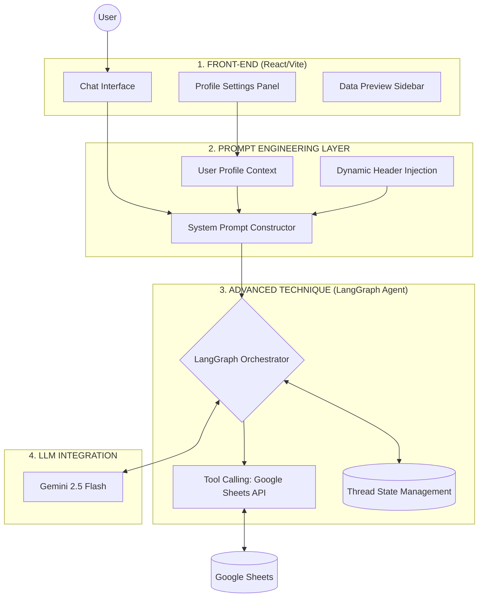
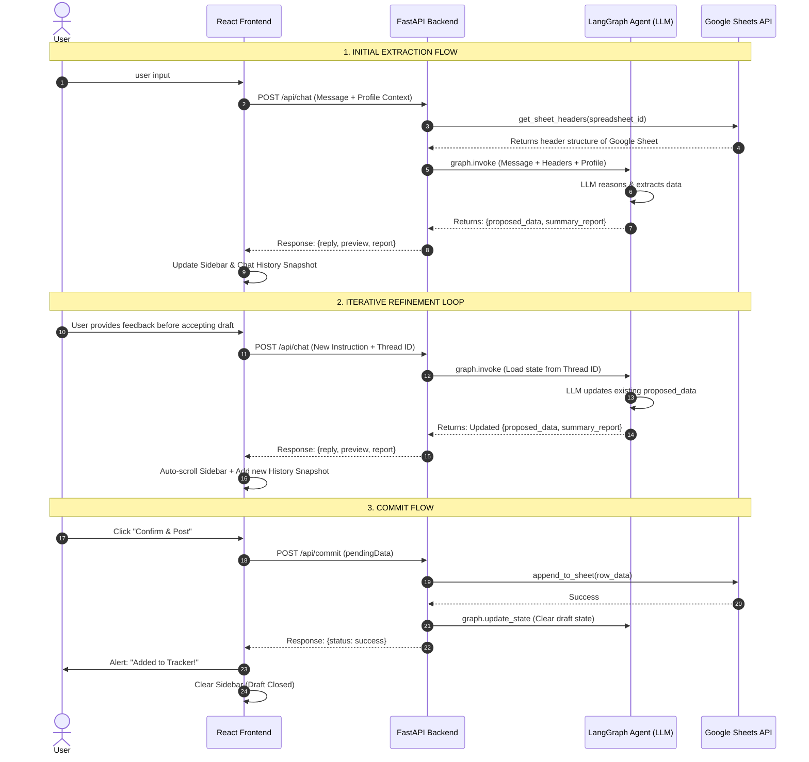

# LeetCode Tracker AI

**Team Member:** Caleb Hageman  
**Chosen Domain:** Agentic Data Orchestration (Software Engineering Technical Interview Prep)

## Overview
LeetCode Tracker AI is a chat-integrated workspace designed to seamlessly extract, format, and log problem-solving sessions into a Google Spreadsheet. Using an agentic workflow, users can describe coding problems or activities in natural language, and the system's LLM automatically maps the narrative to the dynamic schema of their connected Google Sheet. System prompts are fully dynamic and can be customized via the user profile, enabling schema-agnostic data orchestration that applies to any domain-specific formatting.

## Architecture and Data Flow
The application implements a full Agentic Workflow with Tool Calling, satisfying the **Conceptual System Architecture** requirements:

1. **User Interface:** A React (Vite) frontend provides a chat interface, a profile settings panel for prompt customization, and a live data preview sidebar.
2. **Prompt Engineering:** The system uses a **Prompt Constructor** (`backend/prompt_template.py`) that employs a fluent interface pattern to programmatically generate a **System Instruction**. It isolates user profile data and live sheet headers from the **conversation history**, ensuring the AI's core logic remains persistent and distinct from the session state.
3. **Advanced Technique (LangGraph Agent & Tool Calling):** The backend utilizes **LangGraph** to maintain a stateful conversation thread. It employs **Tool Calling** to interact with the Google Sheets API (fetching live headers and appending rows).
4. **LLM Integration:** The agent reasons through the user's input using the LLM (Gemini 2.5 Flash), extracting relevant fields (e.g., Problem Name, Difficulty, Approach) that match the sheet's columns.
5. **Iterative Refinement:** The extracted data is returned as a "Draft" to the frontend. The user can submit follow-up refinements in the chat. The agent updates the draft in its state, and the UI maintains an expandable history of these iterations within the chat thread before the user finally commits the data to Google Sheets.

### System Architecture


### Technical Implementation & Design Rationale

#### 1. Agentic Orchestration (LangGraph)
Standard LLM chains are linear and "forgetful." By using **LangGraph**, the system maintains a stateful graph where the "proposed draft" is a persistent variable in the agent's memory. This allows for complex, multi-turn refinements where the user can correct specific fields without the agent losing track of the rest of the extraction.

#### 2. Dynamic Schema Discovery (Tool Calling)
Hard-coding spreadsheet columns (e.g., "Problem", "Date") makes an application static and less useful. I implemented a **Tool-Calling** pattern where the agent first calls `get_sheet_headers`. This "grounds" the LLM in the live reality of the user's specific spreadsheet, allowing the same agent to work across different tracking templates without code changes.

#### 3. Human-in-the-Loop (Refinement Loop)
Directly writing AI output to a database is risky. The **Draft-Preview-Commit** architecture ensures that the user acts as a final validator. The UI design facilitates this by providing **expandable snapshots** in the chat thread, allowing the user to track how the data evolved through their refinements before finally persisting it to Google Sheets.

#### 4. Frontend-driven Context (Prompt Engineering)
To make the AI feel personalized, the system injects the **User Profile** (experience, goals, preferences) into the system prompt at the start of every thread. This ensures that the "Summary Report" and "Observations" are contextually relevant to the specific user's learning journey, rather than being generic AI feedback.

#### 5. State Persistence & Threading
Bridging the gap between stateless HTTP requests and stateful AI sessions was accomplished by utilizing a **Thread ID** system (mapping to the user's Google Email or a unique UUID) that serves as a primary key in the backend's state manager. This ensures that even if the user refreshes their browser, the iterative refinement loop remains intact.

#### 6. Prompt Construction
Rather than using static strings, I implemented a **`PromptTemplate`** class that allows the backend to chain instructions together (e.g., `.with_role().with_context().with_constraints()`). This "Baking" process generates a persistent **system prompt** that isolates immutable task logic (Decomposition and Scaffolding) from the mutable conversation history. By separating rules from data, we improve instruction adherence and reduce "instruction drift" over long chat sessions.


### Data Flow (Sequence Diagram)


### Description of Stages
1. **Discovery (`backend/app/mcp_tools.py`):** The system dynamically fetches headers from Google Sheets so the AI knows the exact schema.
2. **Extraction (`backend/app/agent.py`):** The LangGraph agent uses the Gemini LLM to map natural language to the sheet schema.
3. **Refinement (`frontend/src/App.tsx`):** The `thread_id` allows the LLM to remember the current draft across multiple chat messages.
4. **Persistence (`backend/app/main.py`):** Data is only sent to Google Sheets once the user is satisfied with the preview.

## Folder Structure
- `frontend/`: React (TypeScript/Vite) application containing the user interface.
  - `src/App.tsx`: Main application orchestrator; manages global state, local storage, API requests, and ties components together.
  - `src/components/ChatInterface.tsx`: Handles user input and displays the conversation thread with expandable, versioned draft snapshots.
  - `src/components/DataPreview.tsx`: The sticky sidebar that renders the live AI Summary Report and the current Google Sheets draft.
  - `src/components/ProfileSettings.tsx`: Manages user credentials, spreadsheet configuration, and dynamic prompt overrides (Agent Role, Constraints).
- `backend/`: Python (FastAPI) server managing logic, LangGraph state, and API integrations.
  - `app/main.py`: Entry point for the FastAPI server; handles endpoints (`/api/chat`, `/api/commit`), session management, and Google OAuth flow.
  - `app/agent.py`: Defines the stateful `LangGraph` agent, gathers runtime context (user profile, sheet headers), and interacts with the Gemini LLM.
  - `app/prompt_template.py`: Houses the `PromptTemplate` and `DataExtractionTemplate` classes used for modular, chainable prompt construction.
  - `app/mcp_tools.py`: Contains the logic for Tool Calling, specifically fetching headers and appending data to Google Sheets via the Google API client.
- `package.json`: Root-level script runner for convenient project setup.

## Setup Instructions

### Prerequisites
- Node.js (v18+)
- Python (3.10+)
- A Google Cloud Project with the Google Sheets API enabled and OAuth 2.0 Client IDs configured.
- Docker (optional but recommended)

### 1. Environment Variables
1. Copy the `example.env` file to a new file named `.env` in the root directory.
   ```bash
   cp example.env .env
   ```
2. Fill in the required values in `.env`:
   - `GOOGLE_API_KEY`: Your Gemini/Google AI API key.
   - `SPREADSHEET_ID`: The ID from your Google Sheet URL.
   - `GOOGLE_APPLICATION_CREDENTIALS`: Path to your Google Service Account JSON.
   - `GOOGLE_CLIENT_ID` & `GOOGLE_CLIENT_SECRET`: OAuth 2.0 credentials for Google Sign-in.
   - `GOOGLE_OAUTH_REDIRECT_URI`: Usually `http://localhost:8000/api/auth/google/callback`.
   - `SESSION_SECRET`: A random string for cookie security.
   - `FRONTEND_URL`: Usually `http://localhost:5173`.
   - `VITE_API_URL`: Usually `http://localhost:8000`.

### 2. Installation & Running (Docker - Recommended)
The easiest way to start the project is using Docker Compose if docker is already installed:

```bash
docker-compose up --build
```
This will launch the frontend, backend, and all necessary networking automatically.

### 3. Installation & Running (Manual)
If you prefer to run without Docker, you can install dependencies for both the frontend and backend from the root directory:

```bash
npm run install:all
```

Then start both servers:

```bash
npm start
```

- The **Frontend** will be available at `http://localhost:5173`
- The **Backend API** will be available at `http://localhost:8000`
